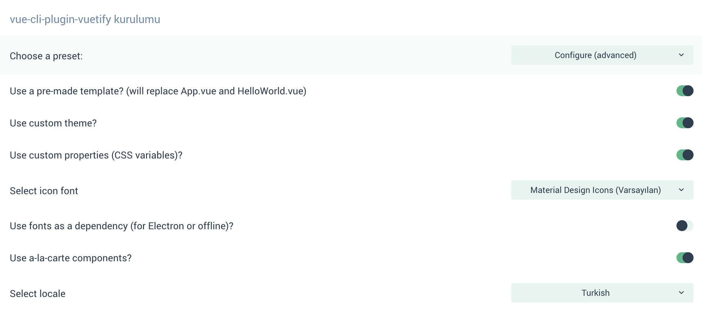
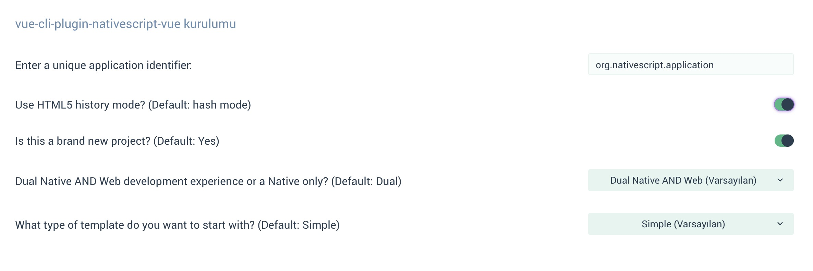

# Nativescript-Vue Notlarım

## Proje yaratma (Vue-UI ile):
Sırasıyla aşağıdaki adımları uygula : 

* kemal-native template 'ini kullanarak bir proje yarat
* vue-cli-plugin-vuetify eklentisini kur, aşağıdaki şekilde ayarla:

* vue-cli-plugin-nativescript-vue eklentisini kur, aşağıdaki şekilde ayarla:

* tüm projede "org.nativescript.application" arat ve "in.takvim.app" ile değiştir
* tns migrate komutu ile projeyi upgrade et
* 

 